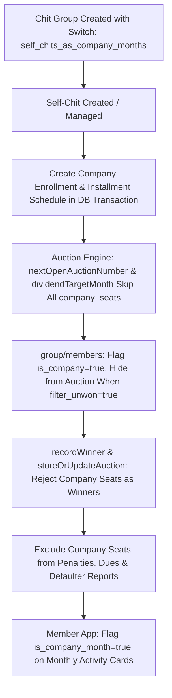

# Plan of Action: Implementing Self Chits as Company Chits

**Date:** Oct 4, 2026  
**Status:** Approved for Implementation (Client & Compliance sign-off confirmed on 4 Oct 2026)  
**Reference Document:** [SELF_CHITS_AS_COMPANY_CHITS (1).md](file:///c:/Users/skafz/OneDrive/Desktop/bitbucketspace/bonagiri/bonagiri-chits-backend/SELF_CHITS_AS_COMPANY_CHITS%20%281%29.md)

---

## 1. Executive Summary & Decisions

The project requirement is to treat all active self-chit seats in an **open-auction chit group** identically to the company chit:
- **No Auction:** The seat month is not auctioned; auction numbers skip these months.
- **Full Chit Amount:** The company takes the full chit amount in that month with no discount.
- **No Dividend:** Members receive no dividend in that month.
- **Ineligible to Win:** The seat cannot be recorded as an auction winner.

### Final Build Decisions (Approved 4 Oct 2026)
1. **Scope:** Applies to **open-auction groups only**. Fixed-scheme groups keep the company months configured in their scheme template.
2. **Activation Switch:** Added as a boolean setting per group (`self_chits_as_company_months: boolean`), off by default. Fixed once the first auction is recorded.
3. **Target Groups:** **New groups only**. Running groups keep existing behavior without recalculation.
4. **Month Assignment:** Each self chit takes its seat number (`slot_id`) as its month (e.g. seat #5 takes month 5).
5. **Auction Numbering:** The auction number **is** the month number. In a 10-month group with company seats #1, #5, #7, auctions are recorded as **#2, #3, #4, #6, #8, #9, #10** (#10 is the final month at full chit amount).
6. **Company Seats Exclusion:** Excluded from penalties, member dues, agent pending lists, and outstanding/defaulter reports.

---

## 2. Architecture & Workflow

---

## 3. Detailed Backend Implementation Breakdown

### 1. Database Schema Update
- Add column `self_chits_as_company_months` (`BOOLEAN` / `INTEGER`, default `0`/`false`) to `chits_groups` table and model [`src/models/chits_group.js`](file:///c:/Users/skafz/OneDrive/Desktop/bitbucketspace/bonagiri/bonagiri-chits-backend/src/models/chits_group.js).
- Accept `self_chits_as_company_months` in `storeOrUpdateChitsGroupService` (`POST /api/chits-group/store-or-update`).

---

### 2. Centralized `getGroupCompanySeats` Helper
- **File:** [`src/utils/schemeHelpers.js`](file:///c:/Users/skafz/OneDrive/Desktop/bitbucketspace/bonagiri/bonagiri-chits-backend/src/utils/schemeHelpers.js)
- Helper returns sorted array of all company seat numbers:
  - If `self_chits_as_company_months` is `true`: returns `[company_chit_number, ...active_self_chit_slot_ids]`.
  - If `self_chits_as_company_months` is `false`: returns `[company_chit_number]`.
- Return `company_seats: number[]` on `POST /api/chits-group/get-by-id` and `POST /api/chits-group/get-all`.

---

### 3. Self-Chit Lifecycle & Real Ticket Creation
- **File:** [`src/services/adminService.js`](file:///c:/Users/skafz/OneDrive/Desktop/bitbucketspace/bonagiri/bonagiri-chits-backend/src/services/adminService.js)
- **Guards on `storeOrUpdateSelfChitService`:**
  - **Member Conflict:** Refuse if `slot_id` is already enrolled by an active member (`delete_status = 0`).
  - **Month Passed:** Refuse if the seat month is already behind the group (last recorded auction number `>= slot_id` or due date has passed).
  - **Group Started:** Refuse adding self-chits once the group has recorded its first auction (to preserve dividend divisor consistency across all enrollments).
  - **Last Month:** Refuse a self-chit on the group's final month (`slot_id === no_of_installments`).
  - **No Slot Mutation:** Refuse changing `slot_id` on edit; force delete and re-create.
- **Company Enrollment Creation:**
  - When a self-chit is created in a group where `self_chits_as_company_months` is active, create the company `Enrollment` (`group_position_number: slot_id`) and generate its `ChitsInstallment` schedule within the same database transaction.
- **Guards on `deleteSelfChitService`:**
  - Refuse deletion once the seat has recorded payments or its month has elapsed.
  - Otherwise, soft-delete both the `SelfChit` and its associated company `Enrollment`.

---

### 4. Auction Numbering & Dividend Targeting
- **File:** [`src/utils/schemeHelpers.js`](file:///c:/Users/skafz/OneDrive/Desktop/bitbucketspace/bonagiri/bonagiri-chits-backend/src/utils/schemeHelpers.js)
- **`nextOpenAuctionNumber(lastRecorded, group, companySeats)`:**
  Advances to the next month number that is **not** in `companySeats`.
- **`dividendTargetMonth(auctionNumber, group, companySeats)`:**
  Target month advances past all consecutive `companySeats` to find the next active subscriber installment.
- **`applyOpenAuctionAdjustments`:**
  Applies the dividend to all enrollments on the correctly targeted non-company installment month.

---

### 5. Winner Protection & Bidder Filtering
- **Files:** [`src/services/adminService.js`](file:///c:/Users/skafz/OneDrive/Desktop/bitbucketspace/bonagiri/bonagiri-chits-backend/src/services/adminService.js), [`src/services/userService.js`](file:///c:/Users/skafz/OneDrive/Desktop/bitbucketspace/bonagiri/bonagiri-chits-backend/src/services/userService.js)
- **`getGroupMembersService` (`POST /api/group/members`):**
  - Always flag `is_company: true` for all seats in `company_seats`.
  - Only filter out company seats when `filter_unwon: true` is passed (used by auction screens and lottery wheels). Keep them present for group detail grids, installment grids, and collection agent views.
- **Winner Validation:**
  - Enforce rejection `"Company seats cannot be auction winners"` in **both** `recordWinnerService` (`POST /api/auction/record-winner`) and `storeOrUpdateAuctionService` (`POST /api/auction/store-or-update`).
- **Regression Fix:**
  - Restore company-scoped `ChitsGroup` lookup in `storeOrUpdateAuctionService` (replace un-scoped `findByPk`).

---

### 6. Exclude Company Seats from Member Dues & Penalties
- Exclude company enrollments (`is_company: true` or company member ID) from:
  - Daily penalty calculation jobs.
  - `POST /api/user/member-dues` & `POST /api/user/collection-agent/member-dues`.
  - Agent pending collections, outstanding reports, and defaulter lists.

---

### 7. Member App Data Contract
- **File:** [`src/services/userService.js`](file:///c:/Users/skafz/OneDrive/Desktop/bitbucketspace/bonagiri/bonagiri-chits-backend/src/services/userService.js) (`getChitDetailsService`)
- In `monthly_activity`:
  - Mark company months with `is_company_month: true`.
  - Set `dividend: 0.00` and leave UI text rendering to the frontend.

---

## 4. Summary of API Contracts

| Endpoint | Method | Change / Added Fields |
| :--- | :--- | :--- |
| `/api/chits-group/get-by-id` | `POST` | `company_seats: number[]`, `self_chits_as_company_months: boolean` |
| `/api/chits-group/get-all` | `POST` | `company_seats: number[]`, `self_chits_as_company_months: boolean` |
| `/api/chits-group/store-or-update` | `POST` | Accepts `self_chits_as_company_months: boolean` |
| `/api/group/members` | `POST` | `is_company: true` on company seats; drops company seats only when `filter_unwon: true` |
| `/api/user/chit-details` | `POST` | `is_company_month: true` on company month items in `monthly_activity` |
| `/api/self-chit/store-or-update` | `POST` | Validates duplicate member seats, past months, group-started status, last month, and blocks slot mutations |
| `/api/self-chit/delete` | `POST` | Rejects delete if payments exist or month has passed; soft-deletes company enrollment |
| `/api/auction/record-winner` | `POST` | Rejects if selected winner is in `company_seats` |
| `/api/auction/store-or-update` | `POST` | Rejects if winner is in `company_seats`; restores company-scoped group query |

---

## 5. Verification & Test Plan

1. **Numbering Simulation:**
   - Create 10-month group with company seats `[1, 5, 7]`.
   - Verify auction sequence: `#2, #3, #4, #6, #8, #9, #10` (Month #10 at full chit amount).
2. **Dividend Flow:**
   - Auction #4 dividend applies to Month #6 (skipping company Month #5).
   - Each dividend is divided across all 10 enrollments.
3. **Guard Validation:**
   - Creating self-chit on existing subscriber seat throws `409 Conflict`.
   - Creating self-chit after first auction throws `400 Bad Request`.
   - Creating self-chit on final month (#10) throws `400 Bad Request`.
   - Editing `slot_id` throws `400 Bad Request`.
4. **Winner Prevention:**
   - Selecting seat 1, 5, or 7 in `record-winner` or `store-or-update` returns `400 Bad Request`.
5. **Financial Isolation:**
   - Company enrollment does not appear in member dues, penalty cron jobs, or defaulter lists.
6. **Feature Toggle Isolation:**
   - Groups with `self_chits_as_company_months: false` maintain existing standard behavior.
