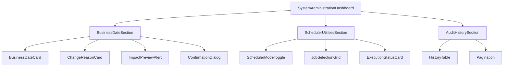
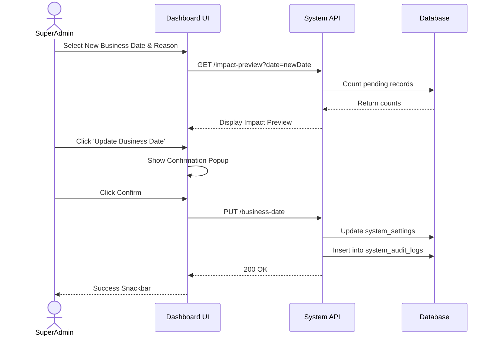

# System Administration Module

This document outlines the architectural design and implementation plan for the **System Administration Module**, focusing on Business Date Management and Scheduler Utilities for the Bonagiri Chits application.

## User Review Required
> [!IMPORTANT]
> Please review the proposed Database schemas, REST API contracts, and Component hierarchy. Once approved, we will begin the implementation phase.

## High-Fidelity UI Mockups

### System Utilities Overview


### Business Date Management


### Scheduler Utilities


---

## 3. Component Hierarchy (Frontend)

The frontend will be built as a responsive, desktop-first React application (or equivalent framework currently in use) following the Bonagiri Chits brand guidelines.



---

## 4. Backend Architecture

The backend will transition from using dynamic real-time calculation (`timeSimulator.js`) to a static, centrally managed **Business Date** fetched from the database.

1. **Global Settings Service**: A new service layer to read/write system configuration.
2. **Business Date Utility**: All existing services (Auctions, Penalties, Dividends) will be updated to replace `new Date()` or `getSimulatedNow()` with `await SystemSettingsService.getBusinessDate()`.
3. **Scheduler Manager**: The node-cron setup will be wrapped in a conditional executor. If `SchedulerMode === 'MANUAL'`, cron jobs will silently return, and processes will only trigger via the `/api/admin/system/jobs/run` endpoint.

---

## 5. Database Table Suggestions

We will introduce two new tables to manage the system state and audit logs.

### Table: `system_settings`
| Column Name | Type | Description |
| :--- | :--- | :--- |
| `id` | INTEGER | Primary Key |
| `business_date` | DATE | The current active business date for the system |
| `scheduler_mode` | ENUM('AUTOMATIC', 'MANUAL') | Controls cron job execution |
| `environment` | VARCHAR | Development, QA, UAT, Production |
| `last_updated_by` | INTEGER | FK to StaffUser |
| `last_updated_on` | DATETIME | Timestamp of last change |

### Table: `system_audit_logs`
| Column Name | Type | Description |
| :--- | :--- | :--- |
| `id` | INTEGER | Primary Key |
| `action_type` | VARCHAR | e.g., 'UPDATE_BUSINESS_DATE', 'RUN_JOB' |
| `previous_value` | JSON | Previous state (e.g., old date) |
| `new_value` | JSON | New state (e.g., new date, reason) |
| `changed_by` | INTEGER | FK to StaffUser |
| `changed_on` | DATETIME | Timestamp |
| `reason` | VARCHAR | Dropdown reason |
| `remarks` | TEXT | Optional remarks |
| `status` | VARCHAR | SUCCESS, FAILED |

---

## 6. REST API Design

### `GET /api/admin/system/settings`
Returns current business date, server date, environment, and scheduler mode.

### `PUT /api/admin/system/settings/business-date`
**Payload:**
```json
{
  "newDate": "2026-08-15",
  "reason": "Auction Testing",
  "remarks": "Testing cycle 4"
}
```

### `GET /api/admin/system/settings/impact-preview?date=2026-08-15`
Returns counts of records that will be affected if the date is changed.
**Response:**
```json
{
  "auctions": 12,
  "penalties": 458,
  "reminders": 76
}
```

### `POST /api/admin/system/jobs/run`
Triggers manual scheduler jobs.
**Payload:**
```json
{
  "jobs": ["AUCTION", "PENALTY", "DIVIDEND"]
}
```

### `GET /api/admin/system/audit-logs`
Returns the history of date changes and job executions.

---

## 7. User Flow Diagram



---

## 8. Validation Rules

1. **Date Constraints**: New Business Date cannot be null.
2. **Reason**: Reason dropdown is mandatory.
3. **Remarks**: If "Other" is selected as the reason, the Remarks text area becomes mandatory (min 10 characters).
4. **Environment Lock**: `SchedulerMode` cannot be set to `MANUAL` in the `Production` environment.

---

## 9. Error Scenarios

1. **Impact Calculation Timeout**: If previewing the impact takes too long, return a generic warning instead of blocking the UI.
2. **Database Transaction Failure**: If updating the `system_settings` succeeds but `system_audit_logs` fails, rollback the transaction to ensure audit integrity.
3. **Job Execution Failure**: If running a manual job fails (e.g., Auction calculation throws an error), the API must catch it and return a `FAILED` status with the error message to display in Card 5 (Execution Status), rather than crashing the server.
4. **Concurrent Modifications**: Implement optimistic locking. If two admins try to change the date simultaneously, the second one should receive a `409 Conflict`.
